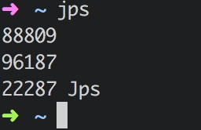

# 第1章-并发编程的挑战

#### 上下文切换

单核处理器也支持多线程执行代码，CPU 通过给每个线程分配 CPU 时间片来实现这个机制。通过**不停切换线程执行**，让我们『感觉是多个线程同时执行的』。

    时间片是 『 CPU 分配给各个线程的时间』，一般几十毫秒。

CPU 通过时间片分配算法来循环执行任务，当前任务执行一个时间片会切换到下一个任务。但是
，在**切换前保存上一个任务**，以便下次切换回这个任务时，可以**再加载**这个任务的状态。

所以**『任务从保存到再加载的过程就是一次上下文切换』**。

由于线程有**创建**和**上下文切换**的开销，所以**多线程不一定更快**。

#### 减少上下文切换

减少上下文切换的开销可以加快多线程。

减少的方法有：

1. 无锁并发编程。
2. CAS 算法。Java 的 Atomic 包使用 CAS 算法来更新数据，而不需要加锁。
3. 使用最少线程。避免创建不需要的线程
4. 使用协程。协程：在单线程里实现多任务的调度，并在单线程里维持多个任务间的切换。（GO 语言有）

PS：CAS 很重要！~后面好多章都提到了！

还学到了几个以前不知道的命令：

- jstack pid 命令可以 dump 线程信息（jdk 里的 java/bin/jstack）
- jps 可以列出线程

#### 死锁

两个线程相互等待对方释放锁就会导致死锁。

避免死锁的常见方法：
1. 避免一个线程同时获取多个锁。
2. 避免一个线程在锁内同时占用多个资源，尽量保证每个锁只占用一个资源。
3. 尝试使用定时锁，使用 lock.tryLock(timeout)来替代使用内部锁机制。
4. 对于数据库锁，加锁和解锁必须在一个数据库连接里，否则会出现解锁失败的情况。

#### 资源极限的挑战

资源限制是指：**在进行并发编程时，程序的执行速度受限于计算机硬件资源或软件资源。**

比如：服务器带宽20m/s，某个资源的下载速度是1m/s，启动10个线程也不会达到10m/s。

在这个例子中

硬件资源限制：

1. 带宽的上传/下载速度
2. 硬盘读写速度
3. CPU的处理速度

软件资源限制：

1. 数据库的连接数
2. socket 连接数

资源限制引发的问题：因资源限制可能会导致比串行还慢，因为增加了 上下文切换和资源调度的时间。

如何解决？

硬件限制：集群并行执行程序，如 ODPS 、Hadoop
软件限制：资源复用，如复用连接池

